Inkscape Guide Creation Tools
==============================

This is a synthesis of the original [Inkscape](http://inkscape.org/) **Guides creator** extension (Extensions > Render > Guides creator) and the **[Inkscape guide tools](https://github.com/sambody/inkscape-guide-tools)** by Samuel Dellicour.

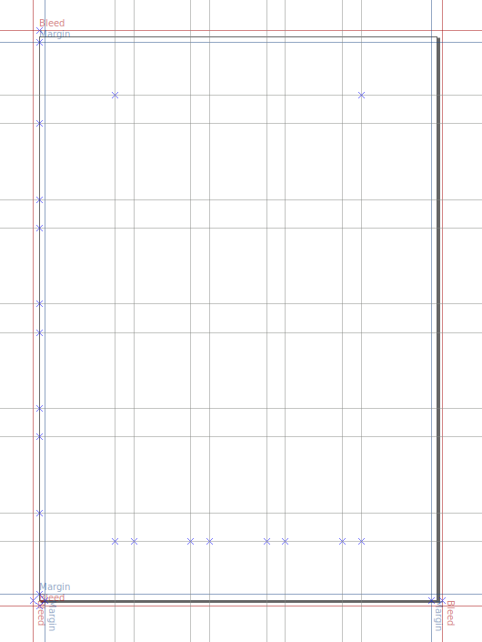

The current version of the extension works with Inkscape 1.4 and supports multiple pages (and choosing which page to apply the guides to).

## Features Overview

The following types of guides can be added to either the **page area** or the **current selection**:

* Presets:
  - centered guides
  - rule-of-third grid
  - golden ratio grid
  - standard right and left book page boundaries
* Edge guides
* Margin guides (all margins different, or all identical):
  - by distance, with units, inside ('margin') and outside ('bleed') selected area
  - by fraction of overall width or height (1/x)
* Grid guides:
  - evenly distributed rows and columns
  - fixed width rows and colums, with optional gutter
* Diagonal guides:
  - 45° from corners
  - from corner to corner

Each set of guides that is created can have its own color, label and lock status.

The extension also allows you to:

* Delete all guides before drawing new ones
* Delete all horizontal, all vertical, or all angled guides

-----

### Examples

#### Preset options

Two examples for available presets:

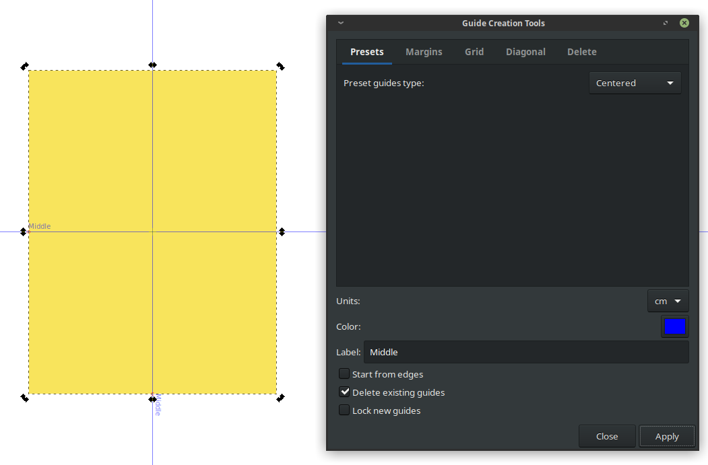

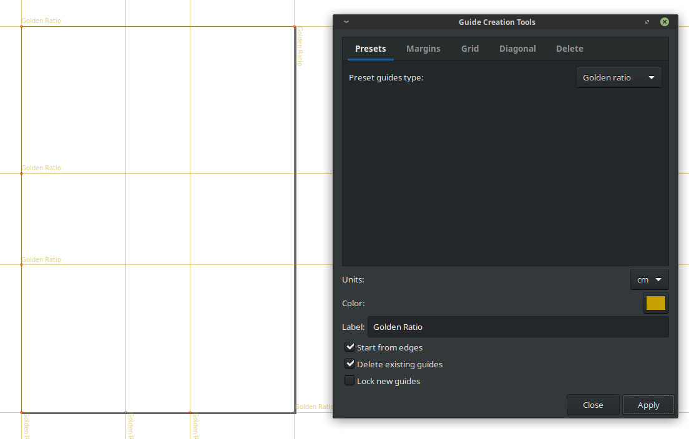

#### Add margin guides to page or selection

Add guides at a certain distance (_margin_) from the borders of the page or the selection. 

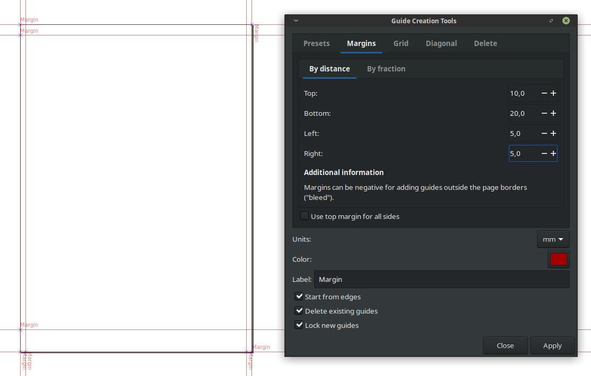

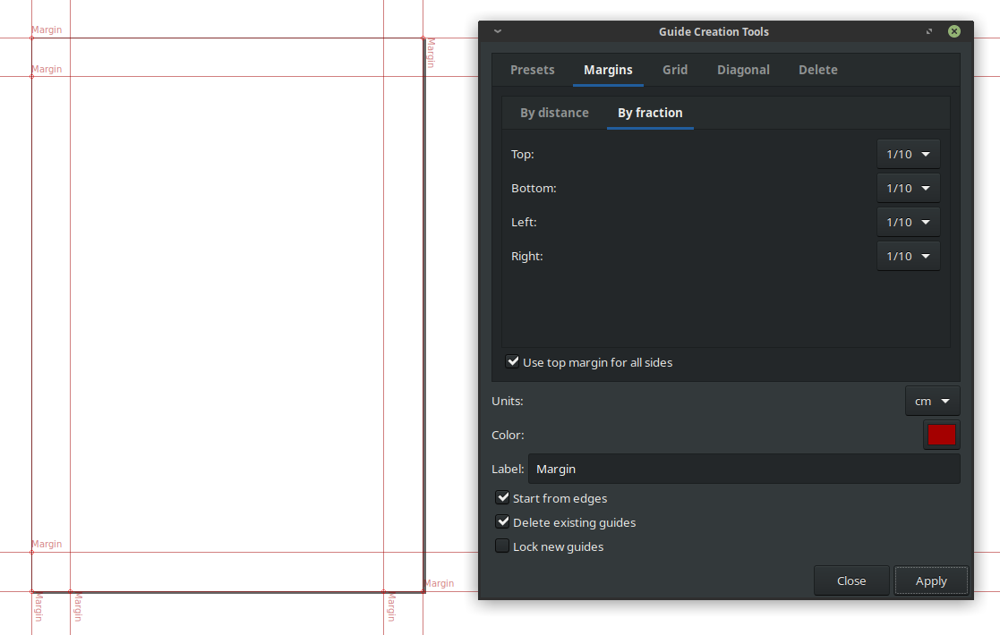

- Add them all at once for equal margins, or add different margins. 
- Negative margins creates guides _outside_ the page/object borders ("bleed"). 
- A single set of zero margin guides (guides exactly on the border) is created when the margin is set to zero, and / or when the 'Start from edges' option is checked. Alternatively, consider using **Edit > Create guides around the page** for that. 
- Use any unit (pixels, mm, in, etc), independantly of your document's units.

#### Add grid guides to page or selection

The extension will generate guides in a grid of **equal width columns (or rows) with or without gutters** (additional spacing between columns). Use any unit (pixels, mm, etc).

The grid dimensions are defined by the number of columns, the column width and gutter width.

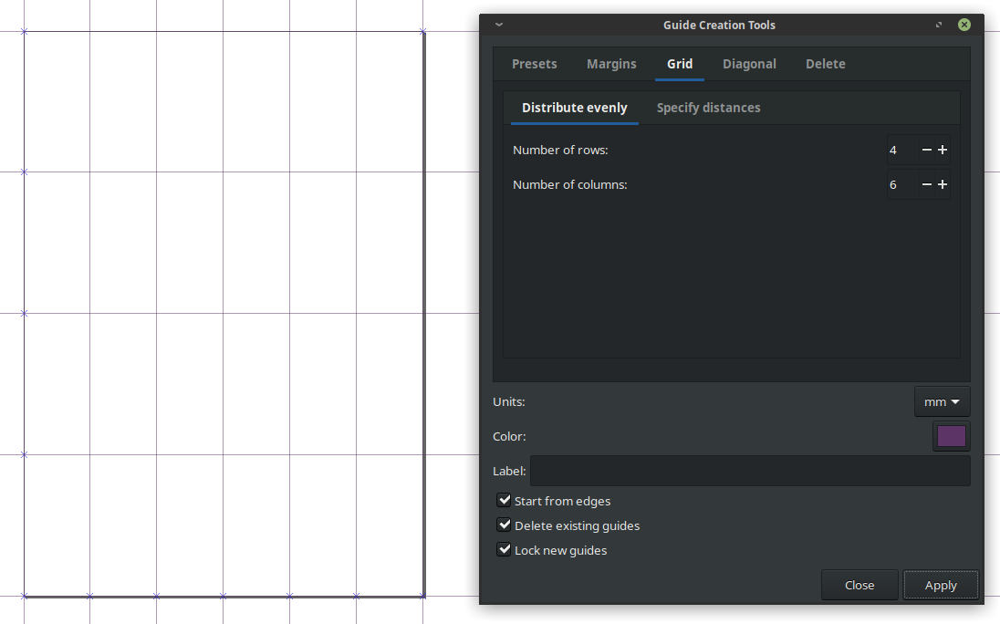

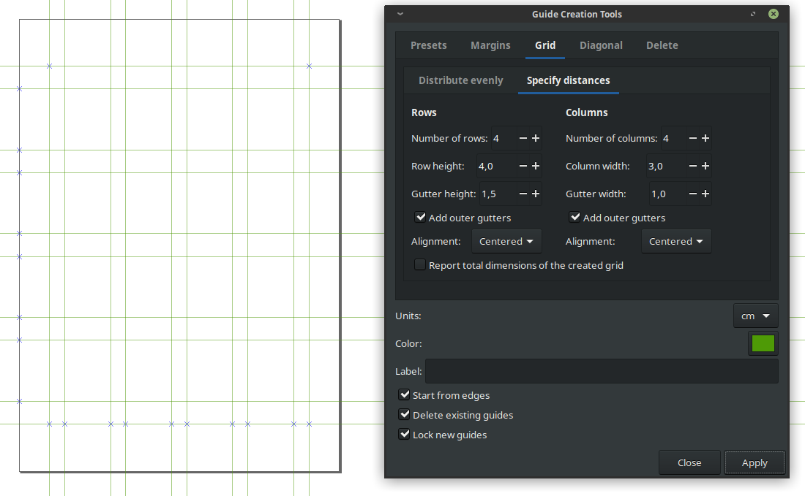

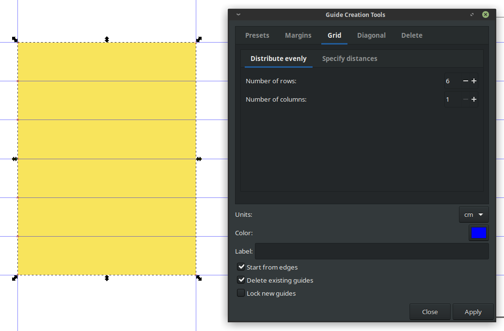

#### Diagonal guides

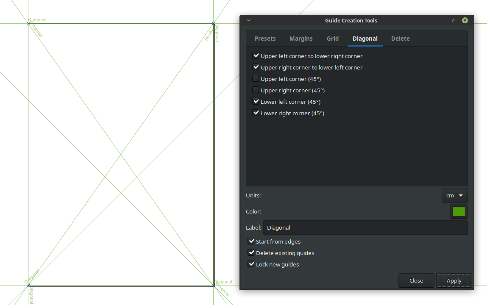

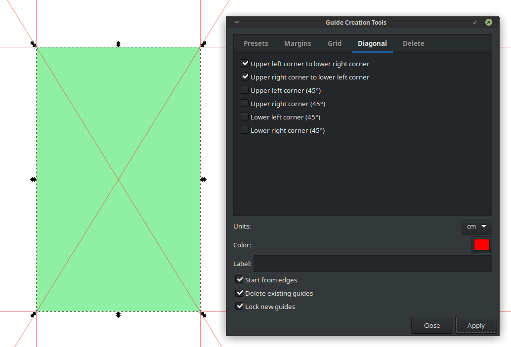

#### Remove selected guides

Selectively remove all horizontal and/or vertical and/or angled (diagonal) guides. 

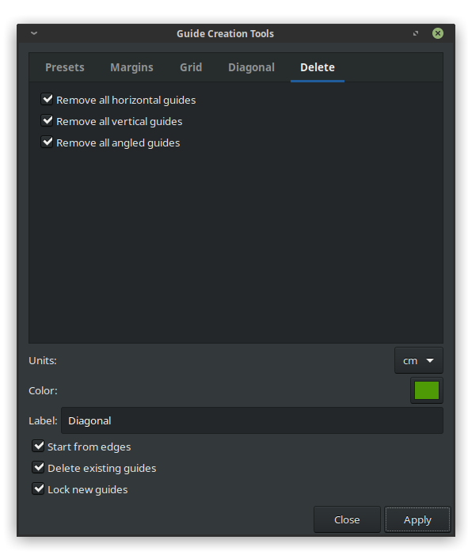

Tip: 

To remove ALL guides from your page, instead of using this extension, you can also go to **Edit > Delete all guides** (Inkscape 0.91 and up).

-----

### Get the extension

[Download the latest version](https://gitlab.com/Moini/inkscape-guide-tools/-/archive/master/inkscape-guide-tools-master.zip), which is compatible with Inkscape 1.2 and higher, but NOT compatible with Inkscape 1.1 or earlier. It requires Python 3 and will not work with Python 2.

If you need a version that is compatible with Inkscape 1.1, visit [the GitLab tag page](https://gitlab.com/Moini/inkscape-guide-tools/-/tags).

For a version compatible with Inkscape 0.92 or earlier, [download Samuel Dellicour's extension directly](https://github.com/sambody/inkscape-guide-tools/archive/master.zip). It does not contain the features provided by Inkscape's original Guides creator extension.

For a version compatible with Inkscape 0.48 or earlier, [download this old version of his extension](https://github.com/sambody/inkscape-guide-tools/archive/1.0.zip), which has less features and will no longer be updated.

#### Installation

1. Unzip (extract) the downloaded archive on your computer;
2. Inside the archive, open the folder named "src". Copy all the files that are inside the "src" folder (NOT the folder itself) into your user extensions folder, which you can find like this:

- open Inkscape
- go to **Edit > Preferences > System**
- copy the folder name listed under the label 'User extensions'
- open the folder with your file browser, or, in Inkscape 1.0, click on the 'Open' button next to it
- drop the .inx and .py file into that folder
- restart Inkscape

#### Where to find the extensions menu

The extension will be available in the menu under **Extensions > Guides > Guide Creation Tools**.

-----

### Tips

- Need a **baseline grid** in addition to the one made up of guides? Use Inkscape's grids under **File > Document Properties > Grids**. Set a new rectangular grid with, e.g., Spacing X = 2000, Spacing Y = 14.
- Using this extension frequently? Starting from Inkscape 0.91, you can easily add a **keyboard shortcut** to an extension. See **Edit > Preferences > Interface > Keyboard shortcuts**.

### Known issues

* Due to a limitation in the Inkscape extensions API, adding guides to the selection will not work reliably if a text object is part of the outer border of the selection (extensions cannot easily determine the text's size without rendering it in the specified font). If you need this, please convert the text (or a copy of it) to a path.
* Top / bottom / left / right alignment doesn't work properly with negative gutter values for grids.

### Licence and credits

The extension was originally heavily based on the code from Grid Creator, part of Inkscape core, under Extensions > Render. Many thanks to that extension's maintainer. It was also based on heathenx's extension _Remove all guides_.

The current one is mostly based upon ideas and small bits taken from Samuel's extension and the code base from Inkscape's Guides Creator extension.

Samuel Dellicour licenced his extension under the GPL v2, just like Inkscape's Guides Creator extension.

Authors:

* Guides Creator: 
  - 2008 Jonas Termeau
  - 2008 Alexandre Prokoudine
  - 2009 Aurélio A. Heckert
  - 2011 Peter Lieverdink
  - 2012, 2016 Nicolas Dufour
  - 2013 Alex Valavanis
  - 2013 Johan B. C. Engelen
  - 2014 Alvin Penner
  - 2017 Marc Jeanmougin
  - 2017 luz.paz
  - 2018-2019 Martin Owens
  - 2019 Ryan Jarvis
  - 2019 Thomas Holder
  - 2019-2023 Maren Hachmann
* Guide tools extension:
  - 2009 Richard Querin
  - 2009 heathenx
  - 2014-2016 Samuel Dellicour, [web designer](http://www.samplify.be/) 
