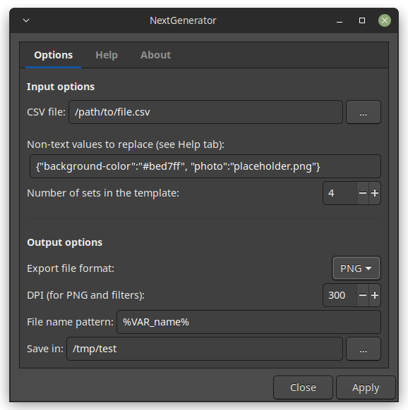
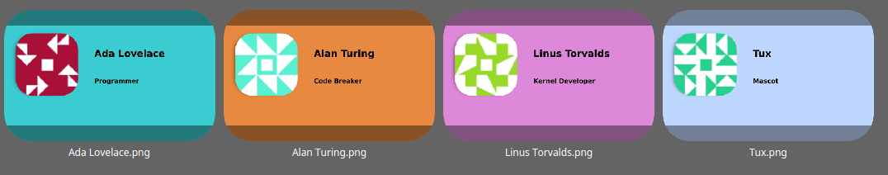

# Inkscape NextGenerator Extension

This is an Inkscape extension to automatically replace values (text, attribute values) in an SVG file and to then export the result to various file formats. This is useful e.g. for generating images for name badges and other similar items.
You can also use the extension to fill in template sheets that contain multiple copies of an item, e.g. an A4 page that holds badges for multiple persons and that will then be printed and cut.
Optionally, the resulting sheets can be merged into a single file after generation.

This extension is a Python rewrite of the Generator bash script extension by Aurélio A. Heckert. It is compatible with Inkscape starting from version 1.0 and requires Python 3.

**Extension dialog:**

**Example result:**

## Installation

See [Inkscape FAQ](https://inkscape.org/learn/faq/#how-install-new-extensions-palettes-document-templates-symbol-sets-icon-sets-etc).

## Menu path

Extensions > Export > NextGenerator

## Tutorial

Máirín Duffy (of the Fedora Design Team) has written and recorded a [tutorial (video + text)](https://blog.linuxgrrl.com/2022/07/19/how-to-automate-graphics-production-with-inkscape/) for this extension that shows how to swap out text content in your SVG files for automating the creation of talk card graphics for a conference. 

## Additional usage hints

Some additional hints:

### General
- if a value in the CSV file contains commas, you must enclose the whole value in quotation marks
- the first line of your CSV file must contain the column names (header)
- you can use spaces to make your CSV file more readable
- spaces and linebreaks are not allowed in the 'Non-text values to replace' field
- Check the tooltips in the extension and the Help tab for more info
- See 'example' directory for a usage example with a set of files to try things out (or online at https://gitlab.com/Moini/nextgenerator/-/tree/master/example)

### Images
- Before you import any placeholder image(s) into your template, check the option `Edit > Preferences > Imported images > Store absolute file path for linked images` (you can change that back afterwards. When unchecked, your folder structure will be less obvious to people you share the file with and the file can be moved and shared more easily.).
- When you import an image that you want to use as a placeholder, choose the option to link it (don't embed).
- Put the replacement images into the same directory as the placeholder image, so you only need to put the new image name in the CSV file, not any parts of the path.
- In some cases, even if you have done everything else correctly, Inkscape will fail to get linked images into exported PNG / PDF files correctly (especially for multiset export). When you open a generated SVG file, it might notify you that it has fixed links for images and the SVG file may look correct. In this case, it can help to do the following:
  - in Inkscape, select the image
  - open the XML editor (Ctrl+Shift+X)
  - find the sodipodi:absref attribute. It should contain the absolute path to your image file on the disk.
  - copy its contents (the path)
  - replace the contents of the xlink:href attribute with the path copied from sodipodi:absref and hit Enter
  - repeat this for each image that was missing from the exported files

### Text
- Sometimes, center-aligned text is easier to manage and/or looks better
- If you must use a variable in a flowed text, first create a normal text (click + type, NOT click + drag). Then use the diamond-shaped handle to adjust the width of the text
- Avoid linebreaks, and make sure your placeholder variables are not cut in parts by (autoflow) linebreaks. 
- Rely on autoflowing of text for replacement texts (linebreaks might not work) or use multiple texts instead.
- If you really need linebreaks in a text that has been created in the above fashion, disable the SVG2 text fallback option in the preferences before you save your template. This will give correct results in PNG and PDF export, but not necessarily with SVG in other viewers.

## Creating a release

* adjust version number in inx file and in py file
* commit with version tag
* create a release on GitLab
* run package_extension.sh
* upload to website along with signature file
