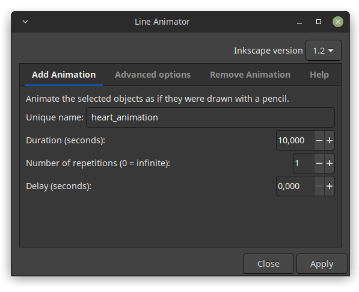

## Inkscape Line Animator

This Inkscape extension creates simple, line-drawing animations from the selected paths.
When you look at the file using a web browser, it will look as if someone were drawing the paths with an invisible pen.

**Notes:**

* Find the extension as `Extensions > Animation > Line Animator`
* **Only path objects** can be used for this.
* **No path effects** should be applied to the paths (something may happen, but 
  perhaps not what you expect).
* The paths must have **a visible stroke** (else you won't see anything happen).
* The object **lowest in stacking order** will be drawn **first**, then the one above it etc.
* Animation speed can be changed by using the same animation name and selecting 
  the same objects, then setting a different duration.
* If you are animating a path consisting of **multiple subpaths**, all of them will 
  start to be animated **at the same time**, but the shorter ones will finish first.
* If you want to **change the direction** in which a path is drawn, change the path 
  direction in Inkscape (`Path > Reverse`).

## Examples

## Installation

Drop the files `line-animator.py` and `line-animator.inx` into your user extensions directory.
Learn where to find the directory in Inkscape: `Edit > Preferences > System > User extensions`.

## License

This software is licensed under the GPL v2.0 or higher.

## Note

* Due to a bug in Inkscape (https://gitlab.com/inkscape/inbox/-/issues/9327), Inkscape 1.3 instantly crashes when you open the Selectors and CSS dialog. So don't do that!
* Inkscape 1.4 does not crash, but try to avoid editing the animated paths with the Selectors and CSS dialog - this may in some cases disable the animation.
