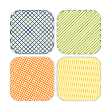

# Hatch Fill extension for Inkscape

Extension based upon the eggbot_hatch extension from https://github.com/evil-mad/EggBot.

Creates plottable hatches (simple, cross-hatch, in a single path or separate) in all closed objects in the drawing or in all selected objects.

Improvements include:

* Updated to work with Inkscape 1.2 and higher
* Simplified a portion of the code
* Added the option to choose units for the hatch distance and inset
* Only depends on inkex now, which makes installation much easier

License: GPLv2 or higher
